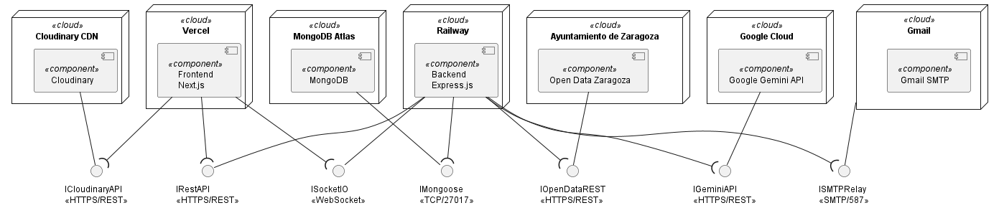

# CELIX — Documentación del Proyecto

---

## 1. URLs de acceso

| Recurso | URL |
|---|---|
| **Frontend (producción)** | https://celix-eta.vercel.app |
| **Swagger / OpenAPI** | https://celix-production.up.railway.app/api-docs |

---

## 2. Credenciales de acceso

| Rol | Email | Contraseña |
|---|---|---|
| **Usuario demo** | usrdemo@gmail.com | 123456 |
| **Administrador** | usradmin@gmail.com | 123456 |

> El rol administrador se asigna manualmente en MongoDB Atlas modificando el campo `rol` del usuario a `"ADMIN"`. Para este usuario ya está puesto.

---

## 3. Arquitectura de la solución




---

## 4. Fuentes de datos abiertos

### API Open Data Ayuntamiento de Zaragoza

- **URL:** https://www.zaragoza.es/sede/servicio/actividades/evento
- **Formato:** JSON (Solr Results)
- **Descripción:** Catálogo de eventos deportivos y culturales del Ayuntamiento de Zaragoza.

**Integración:**
Al arrancar el servidor backend se ejecuta automáticamente una sincronización con esta API. El servicio `events.sync.js` realiza las siguientes operaciones:
1. Llama a la API con el filtro `temas_smultiple:Deporte`
2. Normaliza los datos recibidos (conversión de coordenadas UTM→WGS84, normalización de URLs de imágenes)
3. Hace upsert en MongoDB preservando el campo `oculto` que gestiona el admin
4. Elimina de MongoDB los eventos que ya no existen en la API

El admin también puede forzar una resincronización manual desde el panel de administración.

### API de Instalaciones Deportivas

- **URL:** https://www.zaragoza.es/sede/servicio/equipamiento/basic/instalacion-deportiva-elemental.json
- **Descripción:** Listado de instalaciones deportivas municipales con coordenadas.
- **Integración:** Se consulta directamente en cada petición del frontend, sin persistencia en BD. Las coordenadas se convierten de UTM zona 30N a WGS84 para mostrarlas en el mapa Leaflet.

---

## 5. Módulos del backend

| Módulo | Versión | Descripción |
|---|---|---|
| `express` | 5.x | Framework web para la API REST |
| `mongoose` | 9.x | ODM para MongoDB, gestión de modelos y esquemas |
| `jsonwebtoken` | 9.x | Generación y verificación de tokens JWT |
| `bcrypt` | 6.x | Hashing seguro de contraseñas con salt |
| `socket.io` | 4.x | Mensajería en tiempo real bidireccional |
| `nodemailer` | 8.x | Envío de emails mediante SMTP (Gmail) |
| `@google/generative-ai` | 0.24.x | Cliente oficial de Google Gemini para el feed IA |
| `zod` | 4.x | Validación de esquemas de entrada en los endpoints |
| `swagger-jsdoc` | 6.x | Generación de documentación OpenAPI desde JSDoc |
| `swagger-ui-express` | 5.x | Interfaz web interactiva para Swagger |
| `winston` | 3.x | Logging estructurado con niveles y transports |
| `cors` | 2.x | Gestión de políticas CORS |
| `dotenv` | 17.x | Carga de variables de entorno desde `.env` |
| `nodemon` | 3.x | Reinicio automático en desarrollo |

---

## 6. Swagger / OpenAPI

La documentación completa del API está disponible en:

**https://celix-production.up.railway.app/api-docs**

Incluye todos los endpoints con sus parámetros, cuerpos de petición, respuestas y autenticación Bearer JWT.

---

## 7. Prototipo

El prototipo de la solución fue diseñado en Figma y está disponible en:

**https://www.figma.com/proto/pgQP5HHEFA3nPkM0maA03L/CELIX?node-id=0-1&t=14ehRJZPFi2hPQw6-1**

---

## 8. Frontend — tecnología y módulos

**Framework:** Next.js 14 con App Router  
**Lenguaje:** TypeScript  
**Estilos:** Tailwind CSS  

| Módulo | Descripción |
|---|---|
| `next` | Framework React con SSR, App Router y optimización de imágenes |
| `react` / `react-dom` | Librería UI base |
| `tailwindcss` | Framework de utilidades CSS |
| `shadcn/ui` | Componentes UI accesibles (Button, Select, Tabs, Input...) |
| `recharts` | Gráficas interactivas (barras, pie chart) para el dashboard |
| `leaflet` / `react-leaflet` | Mapa interactivo con marcadores de instalaciones |
| `socket.io-client` | Cliente Socket.io para mensajería en tiempo real |
| `sonner` | Notificaciones toast |
| `date-fns` | Formateo y manipulación de fechas |
| `lucide-react` | Iconos SVG |
| `@playwright/test` | Testing E2E automatizado |

---

## 9. Modelo de IA

### Modelo utilizado: Google Gemini (`gemini-flash-latest`)

**Justificación:** Se eligió Gemini Flash por su alta velocidad de respuesta, coste reducido (tier gratuito generoso) y capacidad para razonamiento sobre listas de datos estructurados. Para el caso de uso de reordenación de posts según preferencias del usuario, la velocidad es más importante que la máxima capacidad de razonamiento, por lo que Flash es preferible a Gemini Pro.

**Funcionalidad:** Ordena el feed "Para ti" según la afinidad del contenido con los deportes y nivel del usuario.

**Integración:**
1. El backend obtiene los últimos posts de la BD
2. Construye un prompt con el perfil del usuario (deportes, niveles, zona) y los IDs + metadatos de los posts
3. Envía el prompt a Gemini Flash
4. Gemini devuelve los IDs ordenados por relevancia
5. El backend reordena los posts según ese orden y los devuelve al frontend
6. Si Gemini falla o no responde, se aplica un fallback determinístico basado en coincidencia de deporte

**Prompt utilizado:**
```
Eres un sistema de recomendación deportiva. 
Dado el perfil de un usuario y una lista de publicaciones, 
ordena las publicaciones de más a menos relevante para ese usuario.

Usuario:
- Deportes y niveles: {deportesNivel}
- Zona: {zona}

Publicaciones (id | deporte | ubicacion):
{posts}

Devuelve ÚNICAMENTE un array JSON con los IDs ordenados, sin explicación.
Ejemplo: ["id1", "id2", "id3"]
```

---

## 10. Validación y pruebas

### Tests unitarios backend (Jest)

Se han implementado tests unitarios para los principales controladores y servicios:

| Fichero de test | Qué prueba | Resultado |
|---|---|---|
| `auth.controller.test.js` | Registro, login, logout, tokens inválidos | PASS |
| `users.controller.test.js` | Actualizar perfil, seguir/dejar de seguir, buscar | PASS |
| `posts.controller.test.js` | Crear post, dar like, quitar like, feed | PASS |
| `admin.controller.test.js` | Ocultar/restaurar posts, bloquear usuarios, gestión eventos | PASS |
| `conversations.controller.test.js` | Crear conversación, listar, enviar mensaje | PASS |
| `events.controller.test.js` | Listar eventos con filtros y paginación | PASS |
| `instalaciones.controller.test.js` | Obtener instalaciones y conversión de coordenadas | PASS |
| `auth.middleware.test.js` | requireAuth con token válido, inválido y expirado | PASS |
| `events.sync.service.test.js` | Sincronización, normalización y eliminación de eventos | PASS |

```bash
cd backend && npm test
```

### Tests E2E frontend (Playwright)

Se han implementado tests E2E con Playwright que se ejecutan en Chromium, Firefox y WebKit:

| Test | Descripción | Resultado |
|---|---|---|
| Login correcto | Usuario introduce credenciales válidas y llega al feed | PASS |
| Login incorrecto | Credenciales erróneas muestran mensaje de error | PASS |
| Registro correcto | Usuario rellena formulario y llega a crear perfil | PASS |
| Registro con contraseñas distintas | Muestra error de validación | PASS |
| Crear publicación | Usuario logueado crea una publicación y llega al feed | PASS |

Para ejecutar los tests E2E es necesario tener el backend corriendo en una terminal separada:

```bash
# Terminal 1 — arrancar el backend
cd backend && npm run dev

# Terminal 2 — ejecutar los tests E2E (arranca el frontend automáticamente)
cd frontend && npm run e2e
```

---

## 11. Mejoras opcionales implementadas

### 1. Sistema de notificaciones por email (0,6 pts)
Implementado con **Nodemailer + Gmail SMTP**. Se envían notificaciones automáticas a los usuarios cuando un administrador realiza alguna de estas acciones:
- Ocultar una publicación → email al autor
- Restaurar una publicación → email al autor
- Bloquear un usuario → email al usuario bloqueado
- Desbloquear un usuario → email al usuario

### 2. Validación E2E del frontend (1 pt)
Implementado con **Playwright**. 4 tests que se ejecutan en 3 navegadores (Chromium, Firefox, WebKit) cubriendo los flujos de login y registro. Los tests arrancan el servidor Next.js automáticamente mediante `webServer` en la configuración de Playwright.

### 3. Analizador estático de código (0,5 pts)
Implementado con **ESLint** (detección de errores y code smells) y **Prettier** (formato de código) tanto en frontend como en backend. Se ejecutan automáticamente en el pipeline de CI.

### 4. Integración continua con GitHub Actions (1 pt)
Se han configurado dos workflows en `.github/workflows/`:

**`ci-backend.yml`** — Se ejecuta en cada push a `main` y en pull requests que modifiquen el backend:
- Instala dependencias con `npm ci`
- Ejecuta el linter (`npm run lint`)
- Ejecuta los tests Jest (`npm test`)

**`ci-frontend.yml`** — Se ejecuta en cada push a `main` y en pull requests que modifiquen el frontend:
- Instala dependencias con `npm ci`
- Ejecuta el linter (`npm run lint`)
- Ejecuta el build de producción (`npm run build`) para detectar errores de compilación

---

## 12. Valoración global del proyecto

CELIX ha sido un proyecto ambicioso que ha permitido al equipo trabajar con un stack moderno y completo (Next.js + Express + MongoDB) aplicando conceptos de arquitectura REST, tiempo real con Socket.io, integración con APIs externas e inteligencia artificial.

El mayor aprendizaje ha sido la coordinación entre frontend y backend en un entorno de despliegue real (Vercel + Railway), con los retos que eso implica en cuanto a variables de entorno, CORS y gestión de sesiones.

El resultado es una aplicación funcional y desplegada que cubre los requisitos principales del enunciado y añade funcionalidades adicionales como el sistema de recomendación IA y las notificaciones por email.

---

## 13. Mejoras propuestas y limitaciones conocidas

### Limitaciones conocidas

- **Datos de instalaciones incompletos:** La API Open Data de Zaragoza para instalaciones deportivas solo devuelve nombre y coordenadas. Dirección, teléfono y horario no están disponibles en ese endpoint.
- **Feed IA sin aprendizaje:** El modelo Gemini reordena posts en cada petición pero no aprende del comportamiento del usuario a lo largo del tiempo.
- **Sincronización de eventos manual/al arrancar:** No hay sincronización periódica automática (cron job). Los eventos solo se actualizan al reiniciar el servidor o al pulsar el botón de sincronización manual en el panel admin.

### Mejoras propuestas

- Implementar un cron job para sincronización automática de eventos cada 24h.
- Añadir aprendizaje del comportamiento del usuario (posts vistos, likes) para mejorar las recomendaciones IA.
- Implementar notificaciones push en el navegador para mensajes nuevos.
- Implementar login social (Google, GitHub) además del login local.
- Aumentar la cobertura de tests hasta el 75%.
- Añadir un sistema de reporte de contenido inapropiado por parte de los usuarios.

---

## Arranque en local

## Arranque en local

### Requisitos previos
- Node.js 18+
- npm 9+
- Cuenta en MongoDB Atlas (o MongoDB local)

### 1. Clonar el repositorio
```bash
git clone https://github.com/Celix-Zaragoza/Celix.git
cd Celix
```

### 2. Configurar el backend
```bash
cd backend
npm install
```

Crea un archivo `.env` en `backend/` con:
```env
PORT=3001
NODE_ENV=development
MONGO_URI=mongodb+srv://<usuario>:<password>@<cluster>.mongodb.net/<nombre_bd>?appName=<app>
JWT_SECRET=una_clave_secreta_larga_y_aleatoria
EMAIL_USER=tucuenta@gmail.com
EMAIL_PASS=xxxx xxxx xxxx xxxx
GEMINI_API_KEY=tu_api_key_de_gemini
FRONTEND_URL=http://localhost:3000
```

```bash
npm run dev
```

### 3. Configurar el frontend
```bash
cd frontend
npm install
```

Crea un archivo `.env.local` en `frontend/` con:
```env
NEXT_PUBLIC_API_URL=http://localhost:3001
```

```bash
npm run dev
```

La app estará disponible en `http://localhost:3000` y la API en `http://localhost:3001`.
